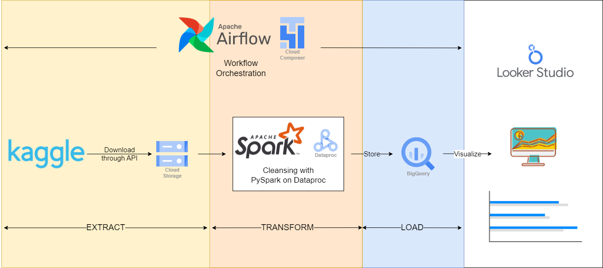

# Top Spotify Songs 2023 Data Engineering Project

## Overview


This project is a data engineering endeavor aimed at building a resilient data pipeline for Extract, Transform, Load (ETL) tasks using PySpark, Google Cloud Platform (GCP), and Apache Airflow. The primary objective is to establish an efficient pipeline capable of processing large volumes of data from the dataset and transforming it into a usable format for further analysis and insights.The primary dataset utilized in this project is the `top-spotify-songs-2023` by `nelgiriyewithana`, sourced from Kaggle.


## Prerequisites
Before running the project, ensure you have the following prerequisites installed and configured:

- **Kaggle Account**: Create a Kaggle account if you haven't already
- **Kaggle CLI and API Key**: Follow [this guide](https://www.kaggle.com/docs/api) to set up the Kaggle API and generate a Kaggle API key and configure it for authentication
- **Google Cloud Account**: If you don't have a Google Cloud account, you can create a free trial account [here](https://cloud.google.com/free).

## Usage
At the moment, all tasks are performed manually. You can follow these steps to execute the data pipeline:

1. **Download Dataset**: 
    - Download the `top-spotify-songs-2023` dataset from Kaggle by running the following command:
    ```bash
    kaggle datasets download -d nelgiriyewithana/top-spotify-songs-2023 --unzip -o -p /data
    ```
    - Alternatively, you can create a bucket on Google Cloud Storage (GCS) to serve as a data lake and upload the CSV file to it.

2. **Perform Data Processing and Transformation**:
    - Process and transform the data using PySpark scripts manually. This may involve tasks such as cleaning, aggregating, and structuring the dataset as needed for analysis.
    - **Note**: You will need to install PySpark manually on your local workspace if you want to follow along. Additionally, the data cleaning script is written in a notebook format for ease of use and collaboration. You can follow the installation steps provided in the Jupyter extension for Visual Studio Code [here](https://marketplace.visualstudio.com/items?itemName=ms-toolsai.jupyter) to set up your environment on VSCode.

3. **Load Cleaning Data to BigQuery**:
    - Create a dataset in BigQuery to store the cleaned data.
    - Create a table from the CSV file containing the cleaned data. If you uploaded the CSV file to your data lake bucket on Google Cloud Storage (GCS), you can load the data directly from there. Otherwise, upload the CSV file from your local machine.
    - During the table creation process, ensure to check 'auto detect' in the schema section to automatically detect the schema from the CSV file.

4. **Visualize**:
    - Create a view from the table created in step 3 using the following query:
    ```sql
    CREATE VIEW `{project_id}.{dataset_name}.{view_name}` AS
    SELECT * FROM `{project_id}.{dataset_name}.{table_name}`
    ```
    - Note: When you open a new query window, it will automatically generate the `SELECT * FROM {project_id}.{dataset_name}.{table_name}` line. You can copy the table part and change `{table_name}` to `{view_name}` easily. Alternatively, choose the columns you want to use in the dashboard.
    - Create a dashboard using your preferred tool, such as Power BI, Tableau, or Looker. In this project, I use Looker.
    - View the dashboard [here](https://bit.ly/43ICrkV)

### Status
Currently Working On: Setting up Airflow DAG and defining tasks to automate pipeline.


